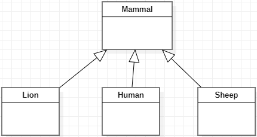

# Introduction to UML Class Diagrams
### Association

```cpp
class Patates {
	// fried
};

class Pitogyro {
	Patates p1;
	// more attributes
};

```


<br>
<br>

### Dependency

```cpp
class Tzatziki {
private:	
	int garlic;
	// more attributes

public:
	int reveal_garlic_level() {
		return garlic;
	}
	// more methods
};


class Pitogyro {
private:
	// attributes

public:
	bool spicy_level(Tzatziki h) {
		bool result = false;
		if (h.reveal_garlic_level() > 3) {
			return true;
		}
		return result;
	}
};
```


<br>
<br>

### Inheritance

```cpp
// Base class
class Mammal {
public:
    void sound() { cout << "..."; };
    // more methods
};

// Derived class 01
class Lion : public Mammal {
public:
    void sound() { cout << "Grarrgraaagrgr\n"; };
    // more methods
};

// Derived class 02
class Human : public Mammal {
public:
    void sound() { cout << "Let's code!\n"; };
    // more methods
};

// Derived class 03
class Sheep : public Mammal {
public:
    void sound() { cout << "Mpeeee\n"; };
    // more methods
};

```

